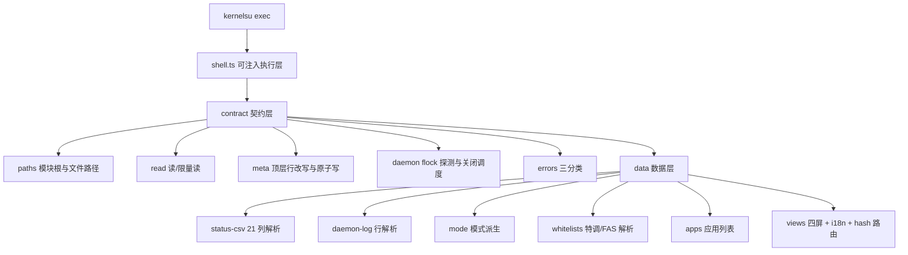

## 产品概述

将现有 ChiRi 的 WebUI 从旧技术实现整体重写，界面用于查看与控制 Android 上的 ChiRi 调度守护进程：做存活探测、读写生效配置、展示应用规则与日志。重构只保留与守护进程的接口契约，不迁就旧版页面结构、路由与视觉。

## 核心功能

- 存活状态：判断调度守护进程是否在跑，支持"关闭调度"（先停看门狗再停主进程），并提示恢复方式
- 当前状态总览：当前生效模式（节能/均衡/性能/极速/FAS/特调）、模块名与版本、生效配置文件路径
- 配置读写：展示生效配置抬头字段；可修改日志等级、开发记录开关、FAS 与息屏场景模式总闸、守护进程日志语言；写入后回读实际值，非法值被守护进程恢复时如实反映
- 应用与规则：列出已安装应用，标注"特调"与"FAS 白名单"标签（仅特定机型存在），展示现存应用性能模式，支持重新扫描；规则本身只读
- 日志查看：查看本次运行的守护进程日志（按级别区分），查看每秒状态快照；说明展示的是最近一段而非全部，并说明历史日志仅存在于归档包中
- 特性可见性：设备上不存在的能力（非专属机型）显示"不适用"，读取失败与"空"区分对待；界面只陈述"已配置"，生效状态以守护进程观测值为准

## 视觉效果

工业感、战术信息层级、终端式反馈：深色底、切角几何、细描边、高对比数据排版；四屏（状态总览 / 配置 / 应用与规则 / 日志）保持一致顶栏与底部导航；日志页局部采用更强的终端观感。交互状态（选中、禁用、无效、加载、空、错误）均有明确表达，触控目标不小于 44px，动效遵循系统减弱动效设置。

## 技术栈

- 语言/框架：TypeScript 5 + Svelte 5（runes），Vite 构建（沿用现有 Vite 链路）
- 样式：`@yunyoujun/ak-ui` **锁定 1.0.0**（npm dist-tag `latest` = 1.0.0，2026-09-12 发布；`next` 仅为 1.0.0-rc.1，无需使用），引入 `@yunyoujun/ak-ui/style.css`（完整 CSS Core），风格强度经作用域属性 `data-ak-ui="system"` 启用，日志页局部 `data-ak-ui="terminal"`
- 设备交互：沿用 `kernelsu` npm 包（`exec`/`toast`/`listPackages`/`getPackagesInfo`/`moduleInfo`/`enableEdgeToEdge`）
- YAML 解析：沿用 `js-yaml`（仅解析 meta / rules / 白名单）
- 类型检查：`svelte-check`（替换 `vue-tsc`）
- 测试：`vitest`（契约层与数据层为纯逻辑，可脱离真机跑断言）
- 构建链不动：`xtask` 仍执行 `npm run build` 并把 `webui/dist` 拷到模块 `webroot/`；CI 仍 `npm install` + `cargo xtask build --no-pack`；`base: './'` 与 `index.html` 的 `type="module"` 两个硬约束保持

## 实现方案

就地重写 `webui/`（保留目录名与 `dist` 输出路径，删除旧 Vue/Vant/Pinia/vue-i18n/vue-router 源码与配置，不留兼容层）。分层递进，上层只依赖下层接口：

```
kernelsu exec ──> shell(可注入) ──> contract(契约层) ──> data(数据层) ──> views(界面)
                      ^                                                        |
                      └────────────── dev mock / 单测 fake ────────────────────┘
```

关键决策与理由：

1. **shell 可注入**：定义最小接口 `ShellRunner { exec(cmd): Promise<{errno,stdout,stderr}> }`。真实实现走 `kernelsu.exec`，dev/单测注入 fake 或 mock 数据。这是"契约层可脱离真机断言"与"无 KernelSU 环境可预览"两个诉求的共同前提。
2. **错误三分类**：`Ok(value)` / `Absent(契约允许的缺失)` / `Failed(真实失败)`。设备上不存在的能力（非专属机型的白名单文件、无 status.csv）归 `Absent`，UI 显示"不适用"；`cat` 非零退出且非文件缺失归 `Failed`，界面明确报错，不吞成空值。
3. **写配置的最小化改写**：只做 meta.yaml 顶层行替换（保留注释、引号风格、其他键），字段缺失时兜底整文件重写；写入走 `base64 | base64 -d > tmp && mv -f tmp target`（避免 shell 注入与半截文件）。daemon 监听 `CLOSE_WRITE|MOVED_TO`，两种写法都能触发热重载。写入后必须回读并呈现实际值（daemon 会在文件非法时用内嵌默认整体覆盖）。
4. **多字段改动串行化**：前端维护一次性"读-改-写"事务队列，避免连点开关互相覆盖；单次提交只写一次文件。
5. **存活探测用 flock 而非 pidof**：`daemon.lock` 的 flock 是唯一可靠判据。命令必须写成"带命令、命令结束即释放"的形式（如 `flock -n <lock> true`），否则不带命令时 flock 会从 stdin 持续持锁，把守护进程挡在门外；先探测 flock 是否可用（busybox），不可用时显示"无法判定"，**不退回 pidof**。
6. **日志限量读取**：一律用 `tail` 取尾部（daemon.log 取尾部若干 KB 后按行切分；status.csv 取尾部 N 行），禁止整文件读取（daemon.log 单文件 50MB、status.csv 8MB）；界面明确标注"最近一段"。
7. **平台差异显式建模**：`status.csv`、`devimp/`、`special_tuned.yaml`、`fas_whitelist.yaml` 仅特定机型产生；界面据此显示"不适用"而非错误。
8. **视觉全部走 ak-ui token**：不散落硬编码颜色/间距/动效；交互原语优先原生语义元素（`<button>`/`<input type="checkbox" role="switch">`/`<dialog>`/`<details>`），按 ak-ui 状态属性映射样式，不为展示类元素引入 headless 库。

性能与可靠性：

- 读取复杂度与文件大小解耦（tail 固定窗口），无整文件装载；应用列表一次拉取后前端过滤，扫描期间按钮互斥禁用防并发
- 定时刷新合并（状态与模式低频刷新，日志仅手动/进入页面时拉取），避免 WebView 内高频 IO
- 所有 shell 命令参数经 base64 或严格白名单路径拼接，路径统一拒绝 `..`；写入原子化

## 架构设计



## 目录结构

```
webui/
├── index.html                    # [MODIFY] 保持 <script type="module">，标题与 meta viewport
├── package.json                  # [MODIFY] 换依赖：svelte 5 / @yunyoujun/ak-ui 1.0.0 / js-yaml / kernelsu；dev: vite/svelte-check/vitest；删 vue/vant/pinia/vue-i18n/vue-router
├── vite.config.ts                # [MODIFY] 换 svelte 插件；保留 base './' 与构建期配置嵌入插件（供 mock）；产物仍为 dist
├── svelte.config.js              # [NEW] runes 与预处理配置
├── tsconfig.json/app.json        # [MODIFY] Svelte + TS 配置替换 vue-tsc 配置
├── src/
│   ├── main.ts                   # [MODIFY] Svelte 5 mount 入口
│   ├── App.svelte                # [NEW] 顶层骨架：顶栏 + 视图容器 + 底部导航
│   ├── app.css                   # [NEW] 引入 ak-ui style.css（tokens+css）、项目级 token 映射与全局基础样式
│   ├── kernel/shell.ts           # [NEW] ShellRunner 接口 + kernelsu 实现 + fake 实现
│   ├── contract/
│   │   ├── paths.ts              # [NEW] 模块根（优先 kernelsu.moduleInfo，回退 /data/adb/modules/chiri）与全部接触点路径、路径安全校验
│   │   ├── errors.ts             # [NEW] Ok/Absent/Failed 三分类与统一错误文案
│   │   ├── read.ts               # [NEW] readFile / readTail(file, bytes|lines) / 目录列举（devimp、logd）
│   │   ├── meta.ts               # [NEW] meta.yaml 读取与字段校验、顶层行替换、原子写、写后回读
│   │   └── daemon.ts             # [NEW] flock 探测（含 flock 可用性检测）、watchdog.pid 读取、stopScheduler、action.sh 存在性
│   ├── data/
│   │   ├── status-csv.ts         # [NEW] 21 列解析（表头识别、type 过滤、缺测 '-'、本地时间），返回类型化快照行
│   │   ├── daemon-log.ts         # [NEW] 行解析 [时间][级别][模块] 消息 + 级别高亮分组 + 尾部限量
│   │   ├── mode.ts               # [NEW] current_mode.chr 与特调模式集合派生模式标签与描述
│   │   ├── whitelists.ts         # [NEW] special_tuned.yaml（包名:模式:回退）与 fas_whitelist.yaml（包名:配置名）解析
│   │   └── apps.ts               # [NEW] 应用列表与标签合成（特调/FAS/现存 app_modes）
│   ├── i18n/                     # [NEW] zh/en 文案 + 基于 runes 的轻量 t()（不用 svelte-i18n，避免 Svelte 5 兼容风险）
│   ├── router.svelte.ts          # [NEW] hash 路由（四屏）
│   ├── components/               # [NEW] ak-ui 风格基础件：状态卡/字段行/开关/标签/列表项/空态/错误态/确认弹层/终端面板
│   └── views/
│       ├── OverviewView.svelte   # [NEW] 状态总览
│       ├── ConfigView.svelte     # [NEW] 配置读写
│       ├── AppsView.svelte       # [NEW] 应用与规则
│       └── LogsView.svelte       # [NEW] 日志（局部 terminal 强度）
└── tests/                        # [NEW] vitest：meta 行改写、三分类、status 21 列、日志解析、白名单解析、模式派生、路径安全
```

## 关键代码结构

```ts
// 契约层唯一对外执行原语：真实实现走 kernelsu.exec，dev/单测注入 fake
export interface ShellRunner {
  exec(cmd: string): Promise<{ errno: number; stdout: string; stderr: string }>
}

// 读取三分类：区分「空值」「契约允许的缺失」「真实失败」
export type ReadResult<T> = { kind: 'ok'; value: T } | { kind: 'absent' } | { kind: 'failed'; error: string }

// status.csv 行（21 列，仅 Chiri 设备产生；timestamp 为设备本地时间 HH:MM:SS.mmm）
export interface StatusSnapshot {
  timestamp: string; mode: string; pkg: string; charge: string; screenOn: boolean
  battTempC?: number; cpuTempC?: number; thermalCap?: string; thermalFree?: string
  clgActive: boolean; psiCpu?: string; psiIo?: string; psiMem?: string
  gpuBusy?: string; battVoltageV?: string; battCurrentMa?: string; battPowerW?: string
  wakeups?: number; migrations?: number; freqTrans?: number
}

// 写入策略：只改目标字段，绝不整体重排；写后回读
export interface MetaWriter {
  read(): Promise<Record<string, unknown>>
  setField(field: 'language' | 'loglevel' | 'dev_record' | 'fas_enabled' | 'scenemode_enabled', value: string | boolean): Promise<void>
  setFields(patch: Record<string, string | boolean>): Promise<void> // 单次读-改-写事务
}
```

## 实现要点（防回归）

- daemon 接口以 `src/main.rs`（daemon.lock、active_config.chr、白名单导出、日志归档）、`src/logger.rs`（status 表头、daemon.log 轮转与行格式、devimp 命名）、`src/chiri/mod.rs`（current_mode.chr 5s 自愈、config_watcher）、`src/utils.rs::watch_path`、`src/monitor/app_detect.rs::determine_mode` 为准；status.csv 为 21 列，不要写成 22
- 只消费 meta.yaml 的 5 个可写字段；`name`/`author` 仅展示（写下去不会改变 daemon 行为）
- 关闭调度顺序不可颠倒：先按 watchdog.pid 杀看门狗，再 `killall -9 yumi`，最后删除 pid 文件；提示用户经模块 Action 恢复
- 旧日志不回读（每轮启动已归档），历史仅存在于 `logd/*.zip`，界面如实说明
- 高频路径不做整文件遍历与整表渲染，长日志按窗口截断

## 设计风格

采用 ak-ui 设计语言（工业几何 + 战术信息层级 + 终端反馈），风格强度 `system` 全局生效，日志页局部提升为 `terminal`。深色底、切角几何、细描边、数据化排版；不使用任何游戏素材，只使用语义 token 与自绘图形。

## 全局框架

顶栏固定：左侧模块名与版本，右侧守护进程状态指示（运行/已停止）。底部导航四项：状态、配置、应用、日志。视图区为单列滚动，窄屏优先；切屏用 hash 路由；所有可点元素触控高度不小于 44px；动效使用 token 时长并在减弱动效时关闭。

## 页面规划

### 1 状态总览

- 顶栏：模块名与版本、守护进程状态徽标
- 主状态卡：当前模式（节能/均衡/性能/极速/FAS/特调），配模式说明与观测时间
- 信息网格：生效配置路径、机型判定、特调/FAS 是否"不适用"
- 关闭调度区：危险操作按钮 + 二次确认弹层 + 恢复方式说明

### 2 配置读写

- 顶栏：返回与保存状态提示
- 抬头信息区：配置名、作者、日志语言（只读展示）
- 可写项区：日志等级选择、开发记录开关、FAS 总闸、息屏场景模式总闸、守护进程日志语言
- 写入反馈区：上次写入结果、被守护进程恢复为默认值时的说明与重读值

### 3 应用与规则

- 顶栏：计数与"重新扫描"按钮（扫描中禁用）
- 搜索区：包名与应用名即时过滤
- 应用列表区：应用名/包名 + 特调/FAS/模式标签，长列表滚动
- 空与缺失态：无应用、规则只读说明、非专属机型"特调/FAS 不适用"

### 4 日志

- 顶栏：数据源切换（守护进程日志 / 状态快照）
- 终端面板：等宽字体、时间/级别/模块分段着色，默认定位到最新
- 状态快照表：最近若干行关键列（模式、前台包名、温度、充放电、负载）
- 说明区：展示的是最近一段；历史日志在归档包中；刷新按钮与行数说明

## 响应式与状态

单列布局适配手机宽度，无横向溢出；全部页面覆盖加载、空、缺失、错误、禁用、长内容六种状态；错误态给出可执行原因（如"无法判定守护进程状态"）而非空白。

## Agent Extensions

### Skill

- **token-efficient-coding**
- Purpose: 贯穿实现全程——用区块注释做 Grep 锚点、按需分片读取、局部修改而非整文件重写、精简输出，控制长任务 token 消耗
- Expected outcome: 每个新文件带区块索引注释；修改旧文件用局部替换；每完成一阶段在内部记录"已读文件与区块"
- **ak-ui**
- Purpose: 提供设计契约与 CSS 基础：先读 `references/design-language.md` 与 `references/tokens.md` 决定视觉，按 `system`/`terminal` 强度实现，交互原语映射到 ak-ui 状态属性
- Expected outcome: 四屏全部使用 `--ak-*` 语义 token 与 `.ak-*` 类，无硬编码颜色/间距；收尾按 `references/quality-checklist.md` 逐项自检并记录未覆盖项
- **agent-browser**
- Purpose: 本地预览与真机形态走查：起 Vite 预览后用浏览器验证四屏布局、交互状态与移动视口；用截图/快照核对无障碍与溢出
- Expected outcome: 桌面与窄屏两组截图核对通过；打开/关闭、选中、禁用、空、错误、长日志等状态逐一验证；控制台无报错

### SubAgent

- **code-explorer**
- Purpose: 实现契约层与数据层前，核对 daemon 侧业务逻辑细节（日志列定义、模式判定优先级、白名单导出条件、关闭调度的进程顺序）
- Expected outcome: 输出与实现一一对应的契约要点清单，避免凭记忆写错列数、路径或顺序