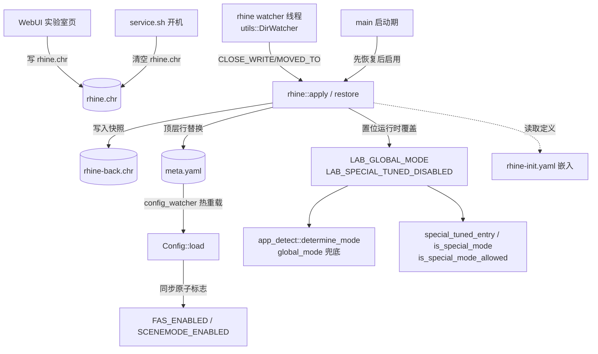

## 产品概述

在 WebUI 配置页新增「实验室」二级入口，用于开关模块内置的实验性调度模式。启用某个实验室模式时，由守护进程按二进制内嵌的定义去调整其它模式的启停（危机合约 = 全局模式切 `fast` + 关闭 FAS + 关闭息屏场景模式 + 关闭所有场景特调），并把改动前的原始状态备份；关闭或重启设备后自动还原。实验室状态对外暴露且可外部修改，通过模块根下的 `rhine.chr` 承载。

## 核心功能

- **入口与页面**：配置页底部新增「实验室」二级入口 → 实验室页面（非底部导航页）。页面顶部为提示词区，说明风险自担、重启设备后自动关闭、启用期间会被关闭的功能；下方为模式列表：危机合约（Contingency Contract，可启用）、矢量突破（Vector Breakthrough，预留，展示为不可用）。
- **状态文件（对外暴露、可手改）**：`rhine.chr` 位于模块根，内容为 YAML 标量，写英文模式 key（`contingency` / `vector`）；文件不存在或内容为空（含仅注释行）= 未启用；格式非法或 key 未知时用二进制内置的默认内容覆盖并告警。
- **启用效果**：全局模式运行时切到 `fast`；`meta.yaml` 的 `fas_enabled` / `scenemode_enabled` 被改写为 `false`（WebUI 开关随之显示为关）；所有场景特调（akmode 白名单）判定失效。原始状态快照写入 `rhine-back.chr`。
- **恢复**：关闭实验室（清空 `rhine.chr`）时立即还原并删除快照；开机由 `service.sh` 清空 `rhine.chr`，守护进程启动时若发现 `rhine-back.chr` 则按快照还原并删除它；快照非法时用二进制内置默认值还原并告警。
- **生效方式**：写入 `rhine.chr` 后运行时立即生效（与 `meta.yaml` 热重载同语义），无需重启调度。

## 界面视觉

沿用现有深色控制台设计语言（ak-ui token、切角按钮、分层背景），新增页面与配置页保持同一套面板/开关/状态占位组件，不引入新的配色与字体体系。

## 技术栈选择

沿用项目现有栈，不新增依赖：

- 守护进程：Rust (edition 2024, nightly) + `serde_yaml` + `inotify`（已有 `utils::DirWatcher`）+ `once_cell::sync::OnceLock` + `libc`
- 配置嵌入：`include_dir!`（`module/config` 整体嵌入）+ `include_str!`（`module/rhine.chr` 模板）
- WebUI：Svelte 5 (runes) + TypeScript `strict` + Vite + `@yunyoujun/ak-ui`（CSS Core）+ vitest
- 构建：`cargo xtask build`；`build.rs` 编译期断言必需配置

## 实现方案

### 关键决策与理由

**1. 新增顶层模块 `src/rhine.rs`（实验室核心）**
`rhine-init.yaml` 的解析、`rhine.chr` / `rhine-back.chr` 的读写校验、启用与恢复流程、运行时 watcher 全部收敛在这一处，避免散落到 `common.rs` / `chiri/mod.rs` / `main.rs` 三处各写一半。ChiRi 专属（非 Chiri 设备不读写 rhine 文件、界面隐藏入口），与 `special_tuned` / `fas_whitelist` 的既有门控口径一致。

**2. 两层落地：文件改写 vs 运行时覆盖（能力边界决定）**

- `fas_enabled` / `scenemode_enabled` 有持久化载体（`meta.yaml`）且已被 `Config::load` 同步为进程级原子标志 → 按用户选择**真改写 meta.yaml**，WebUI 开关同步反映。
- `global_mode` 在 `rules.yaml` 里是编译期嵌入、磁盘副本不生效；`special_tuned` 白名单同样是 `include_str!` 嵌入、无开关 → 二者**只能做运行时覆盖**（新增 `AtomicBool` / `Mutex`，仿 `FAS_ENABLED` 范式；高频路径只读原子量，零 syscall）。

**3. 改写 meta.yaml 必须"顶层行替换 + 原子写"，绝不能 serde 重排**
`common::MetaYamlFile` 是 7 字段全必填 + `deny_unknown_fields`，任何多余键/缺失字段都会让 `sync_meta_snapshot` 用内嵌默认**整体覆盖**整个文件（用户其它改动一并丢失）。因此新增 `common::replace_top_level_bool`（与 WebUI `contract/meta.ts::replaceTopLevelField` 同口径：只匹配缩进为 0 的 `键: 值` 行，保留键名大小写/分隔空白/行内注释）+ `rewrite_meta_toggles`（两个开关**一次写盘** = 一次热重载事件，走既有 `write_file_no_panic` 原子写）。字段未找到时放弃写入（不改文件、不设覆盖），绝不退化成整文件重排。

**4. 启动期顺序：先恢复、后启用**
`rhine-back.chr` 存在 ⇒ 上一次是"开机被清掉"或"不停机重启调度"，两种情况都必须先按快照还原、删除快照，再读 `rhine.chr` 决定是否重新启用（重新启用会以还原后的真实状态刷新快照）。这样"开机 / 重启调度 / 正常运行"三条路径自洽，且不会把"已被改过的状态"当成原始状态。

**5. 状态变更串行化（无锁设计）**
所有 rhine 状态跃迁只发生在两处：① `main` 启动期（此时 watcher 尚未创建）；② 单个 `rhine` watcher 线程内。二者时间上不重叠，故不需要额外互斥；`meta.yaml` 的唯一写入方是 rhine 路径（`config_watcher` 的 `sync_meta_snapshot` 仅在文件非法时写，且内容合法时跳过），不会出现并发改写。

**6. 运行时监听复用既有 `DirWatcher`**
`utils::DirWatcher`（本轮新增）已实现"跨重载复用同一 inotify + 按文件名过滤 + 命中后 100ms 静默清积压"，正好匹配"只关心 `rhine.chr`、且模块根下 `current_mode.chr` 每 5s / `ziped_*` 归档等噪声事件不断"的场景。监听模块根 + 文件名 `rhine.chr`，噪声事件读到即丢，代价可忽略。不复用 `app_detect::watch_config_file`（在 monitor 层、面向 rules.yaml），实验室是 Chiri 专属，独立线程更清晰。

**7. WebUI 不读 `rhine-init.yaml`（"不对外暴露"）**
模式 key 列表在 WebUI 侧硬编码（`data/lab.ts`），中文名与英文名都在 `i18n/locales/{zh,en}.ts` 里写死，与"rhine-init.yaml 只进二进制"的约束一致；并把"新增实验室模式需同步 WebUI 列表与文案"写进 AGENTS.md 作为维护义务。

模式名的英文一律取明日方舟官方译名，不自造：

| key | 中文（zh） | 英文（en） |
| --- | --- | --- |
| `contingency` | 危机合约 | Contingency Contract |
| `vector` | 矢量突破 | Vector Breakthrough |


（已核实：`arknights.global` 官方活动页与 Arknights Terra Wiki 均用 Vector Breakthrough，官方简称 VEC；Contingency Contract 为国际服正式译名。）

### 性能与可靠性

- 高频路径（`special_tuned_entry` / `is_special_mode` / `is_special_mode_allowed` / `determine_mode`）只做一次原子加载加一次 `Option` 判空，无锁、无 syscall、无分配（`is_special_mode` 原本就要遍历白名单，短路反而更快）。
- 文件 IO 全部发生在状态跃迁（用户在界面点一次）与进程启动各一次，不在 tick 内。
- `rhine.chr` 读取按现有轻量口径（限量读取 + 剥空行与注释行），不整读未知大小文件。
- 失败一律保守：meta 不可读或字段缺失时就放弃本次启用并告警（不写快照、不设覆盖），宁可"没生效"也不产生不可还原的中间态。

## 实现注意事项

- **i18n 同步**：新增 daemon 日志 key 必须同时补 `module/config/i18n/zh.ftl` 与 `en.ftl`，命名 `模块-描述`；WebUI 侧补 `i18n/locales/{zh,en}.ts`，英文文案使用明日方舟官方译名（见上表）。
- **文案要像人写的**：实验室提示词、按钮文案、状态标签、日志文案在交付前按 `humanizer-zh` 的规则过一遍——删填充词、拆掉三段式排比、破折号能不加就不加、不写"不仅是……而是……"这类结构、不堆粗体小标题式列表。用户看的是提示词，不是宣传稿。
- **文档同步义务**：`AGENTS.md`（文件接触点 10 → 12、新增实验室区块、"对外暴露审计"补 rhine-init.yaml 不落盘、`config-example.yaml` 无需改因为无新配置段）、`.codebuddy/docs/webui-refactor-plan.md`（契约基准接触点表）、`.codebuddy/memory/MEMORY.md` + 当日日志。
- **打包契约**：`module/rhine.chr` 随模块下发（对外暴露、可手改）；`module/config/rhine-init.yaml` 必须加入 `xtask` 的 `BIN_ONLY` 剔除清单（不对外暴露）。
- **service.sh 只加删除动作**，不动 `action.sh` 与 WebUI 的"重启调度"（按用户拍板）；删除动作必须早于看门狗启动，否则 daemon 可能读到未清空的 `rhine.chr`。
- **界面文案一致性**：`current_mode.chr` 是观测值，实验室启用后界面显示的当前模式会是 `fast`（而不是实验室模式名）；实验室页面必须分别展示"实验室模式（来自 rhine.chr）"与"设备当前模式（来自 current_mode.chr）"，不做因果推断。

## 架构设计



## 目录结构

```
ChiRi/
├── AGENTS.md                                       # [MODIFY] 文件接触点 10→12「rhine.chr / rhine-back.chr」；新增「实验室（rhine）」区块（定义文件、运行时覆盖层、启用/恢复语义、watcher、service.sh 开机清空、WebUI 硬编码模式列表与官方译名的维护义务）；「对外暴露审计」补 config/rhine-init.yaml 不落盘
├── build.rs                                        # [MODIFY] assert_required_configs 的 required 数组加入 "rhine-init.yaml"（缺失直接编译失败，与 meta/feature 同口径）
├── xtask/src/main.rs                               # [MODIFY] BIN_ONLY 数组加入 "config/rhine-init.yaml"（仅进二进制、不落盘、不对外暴露）
├── module/
│   ├── rhine.chr                                   # [NEW] 实验室状态文件模板：仅注释（说明 YAML 标量格式、可写 key、空=未启用、非法会被内嵌默认覆盖），随模块下发供用户查看与手改；语义上是「空文件」
│   ├── service.sh                                  # [MODIFY] [cleanup] 之后、[watchdog-start] 之前新增 [lab-reset] 块：rm -f "$MODDIR/rhine.chr"（实验室状态不跨重启；rhine-back.chr 由 daemon 启动时读取还原后删除）
│   └── config/
│       ├── rhine-init.yaml                         # [NEW] 实验室模式定义（编译期嵌入、不对外暴露）：<模式 key> → 可选影响项 global_mode / fas_enabled / scenemode_enabled / special_tuned；缺省条目=该项不变更。当前条目 contingency（危机合约：global_mode=fast、fas/scenemode/special_tuned 全 false）与 vector（矢量突破：空条目，预留）
│       └── i18n/{zh,en}.ftl                        # [MODIFY] 新增 rhine-* 日志 key：启用、恢复、启动期还原、非法重置、meta 改写失败、未知模式、快照非法回退默认
├── src/
│   ├── main.rs                                     # [MODIFY] `mod rhine;`；在首次 Config::load 之前调用 rhine 启动期处理（先还原 rhine-back.chr、再按 rhine.chr 启用），仅 is_chiri_soc() 时执行；返回结果结构体，在 logger::init 之后补打点（复用 archive_on_startup 的「延后打点」范式）
│   ├── rhine.rs                                    # [NEW] 实验室核心：内嵌 rhine-init.yaml 的 OnceLock 解析（RhineModeDef 全 Option 字段）、rhine.chr 的读取/校验/内嵌默认覆盖、rhine-back.chr 快照与还原、apply/enable 与 restore 流程、watch_loop(root, meta_path)（内含 DirWatcher + 事件循环）。文件读写一律原子写 + 权限对齐既有口径
│   ├── common.rs                                   # [MODIFY] ①新增运行时覆盖层：LAB_GLOBAL_MODE（Mutex<Option<String>>）+ LAB_SPECIAL_TUNED_DISABLED（AtomicBool）及存取函数，仿 FAS_ENABLED 范式；②special_tuned_entry / special_tuned_mode / is_special_mode / is_special_mode_allowed 四处入口在覆盖置位时短路返回；③新增 replace_top_level_bool + rewrite_meta_toggles（顶层行替换 + 一次原子写，未找到字段则放弃写入）
│   ├── monitor/app_detect.rs                       # [MODIFY] determine_mode：把全部 `config.global_mode.clone()` 兜底改为取统一的 `lab 覆盖值 ?? config.global_mode`（入口处算一次局部变量，仅影响 global_mode 兜底，显式 app_modes 优先级不变）
│   └── chiri/mod.rs                                # [MODIFY] 在 start_scheduler_thread 中新增 rhine watcher 线程（仅 Chiri）：thread::Builder 命名 "rhine_watcher" 调 rhine::watch_loop(root, config_path)，异常退避重试与 config_watcher 同口径
└── webui/
    ├── README.md                                   # [MODIFY] 分层说明补 contract/lab.ts、data/lab.ts、views/LabView.svelte 与二级视图说明
    ├── src/
    │   ├── contract/paths.ts                       # [MODIFY] REL 增加 rhine: 'rhine.chr'
    │   ├── contract/lab.ts                         # [NEW] 实验室契约：readLab()（三分类 ReadResult，缺失/空文件按「ok + 未启用」而非 failed）+ writeLabMode(key | null)（先写 .webui.tmp 再原子 mv，一次写入；关闭时写空内容而非删除文件）+ 可用模式 key 常量
    │   ├── data/lab.ts                             # [NEW] 纯解析：剥空行与 # 注释行 → 模式 key（空=未启用、未知 key=非法），供契约层与单测复用
    │   ├── state.svelte.ts                         # [MODIFY] 新增 [lab] 段：labState/labKey/labError/labPending，loadLab() 与 setLab(key|null)（写后回读，与配置页草稿-提交范式一致）
    │   ├── router.svelte.ts                        # [MODIFY] 新增二级视图支持：ViewId 加 'lab'，parse 接受「主视图 ∪ 二级视图」，但 VIEW_IDS（底部导航）保持四项不变
    │   ├── App.svelte                              # [MODIFY] 视图分支增加 `{:else if router.view === 'lab'}<LabView />`
    │   ├── views/ConfigView.svelte                 # [MODIFY] 页面底部新增「实验室」入口面板（含当前是否启用的摘要 + 跳转按钮）
    │   ├── views/LabView.svelte                    # [NEW] 实验室页面：提示词面板 + 模式列表（当前生效态、启用/关闭、矢量突破显示为预留不可启用）+ 返回配置页入口
    │   ├── dev/mock-shell.ts                       # [MODIFY] 设备替身补 rhine.chr（默认空=未启用；按 ?state 提供非法内容形态以覆盖错误分支）
    │   ├── i18n/locales/{zh,en}.ts                 # [MODIFY] lab.* 文案：页面标题、提示词、模式名、启用/关闭/处理中、未启用/已启用/重启后自动关闭、矢量突破预留说明、启用失败。模式名沿用官方译名：zh 用「危机合约 / 矢量突破」，en 用「Contingency Contract / Vector Breakthrough」
    │   └── tests/lab.test.ts                       # [NEW] 纯逻辑断言：解析（空/仅注释/key/带引号/未知 key/非法 YAML）、写入内容生成、状态映射
    └── .codebuddy/docs/webui-refactor-plan.md       # [MODIFY] 契约基准的「文件接触点」表补 rhine.chr / rhine-back.chr 与语义
```

## 关键代码结构

实验室模式定义（`module/config/rhine-init.yaml`，嵌入且不落盘）——"缺省条目 = 不变更"是核心语义：

```
# 影响项（缺省的条目 = 该项不变更，仅写出值的项才在启用时执行）
#   global_mode: <模式名>        运行时覆盖全局模式（rules.yaml 的 global_mode 兜底值）
#   fas_enabled: true|false      改写生效 meta.yaml 的 fas_enabled
#   scenemode_enabled: true|false 改写生效 meta.yaml 的 scenemode_enabled
#   special_tuned: true|false    运行时开关，false = 关闭所有场景特调
contingency:
  global_mode: fast
  fas_enabled: false
  scenemode_enabled: false
  special_tuned: false
vector: {}          # 矢量突破：预留条目，当前不产生任何影响
```

原始状态快照（`rhine-back.chr`，daemon 生成、还原后即删除）——"缺省字段 = 该项未被实验室变更，还原时不动"：

```
# origin: 触发快照的实验室模式 key
# global_mode / special_tuned 仅记录原值，还原 = 直接清除运行时覆盖（它们没有持久化载体）
origin: contingency
global_mode: balance
fas_enabled: true          # 原值，还原时按此写回 meta.yaml
scenemode_enabled: true    # 同上
special_tuned: true
```

守护进程侧运行时覆盖层（`src/common.rs`，与 `FAS_ENABLED` 同范式）：

```rust
/// 实验室：全局模式运行时覆盖（None = 无覆盖，按 rules.yaml 的 global_mode）
static LAB_GLOBAL_MODE: Mutex<Option<String>> = Mutex::new(None);
/// 实验室：关闭所有场景特调（true 时特调四处判定全部短路）
static LAB_SPECIAL_TUNED_DISABLED: AtomicBool = AtomicBool::new(false);

pub fn lab_global_mode() -> Option<String>;
pub fn set_lab_global_mode(mode: Option<String>);
pub fn lab_special_tuned_disabled() -> bool;
pub fn set_lab_special_tuned_disabled(disabled: bool);

/// meta.yaml 顶层行替换（保留注释与其他字段；未找到该字段返回 None = 调用方放弃写入）
pub fn replace_top_level_bool(content: &str, field: &str, value: bool) -> Option<String>;
/// 两个总开关一次原子写盘（= 一次热重载事件）；返回 false 表示未改动文件
pub fn rewrite_meta_toggles(path: &Path, fas: Option<bool>, scenemode: Option<bool>) -> bool;
```

## 设计定位

实验室页是现有配置页的**二级页面**（不进底部导航，导航保持四项不变），沿用 `webui/src/app.css` 已定的深色控制台语言与 ak-ui 语义 token：不新增配色、不新增字体、几何与交互反馈全部来自 ak-ui（切角按钮、`--ak-cut-*`、44px 最小命中区、`--ak-motion-fast` 过渡）。视觉上要让人一眼看出这是"实验性、有代价"的功能，因此提示词区用 `--ak-signal-action` 的暖黄作边框/图标强调，启用态用 `--ak-signal-danger` 的克制描边表达"当前处于实验状态"，而非整块染色。

## 页面结构（自上而下分块）

**1 顶部返回条（块）**
左侧返回按钮（`btn btn--ghost`，箭头 + 「配置」文案）回到 `#/config`；右侧保留页面标题「实验室」。滚动时 sticky 吸顶，背景 `--ak-surface-panel` + 底部一条 `--ak-line-hairline` 分隔线，与 `App.svelte` 顶栏同构。

**2 提示词面板（块）**
`Panel` 承载，标题「实验室」、描述一行「实验性功能 · 风险自担」。正文为列表式提示（每行左侧一个 `--ak-signal-action` 竖条标记）：功能处于实验阶段可能影响续航与稳定性；设备重启后实验室状态自动清除；启用期间 FAS 帧感知调度、息屏场景模式、所有场景特调会被关闭。整块用 `color-mix` 把 `--ak-signal-action` 以极低比例混入 `--ak-surface-muted` 作底，保证在深色画布上是一个"警示但不刺眼"的区块。

**3 模式列表（块）**
每张模式卡为一个 `--ak-surface-raised` 面板，两列布局（左：中文模式名 + 英文 key 的 `.u-mono` 小字；右：状态标签 + 操作按钮）。危机合约卡：未启用时按钮为 `btn btn--primary`「启用」，启用中显示 `ak-tag`「已启用」+「关闭」按钮，并在卡内展开一行当前影响摘要（全局模式→fast、FAS 关闭、息屏场景关闭、场景特调关闭，均为 `.u-muted` 小字）。矢量突破卡：整体 `opacity: .55`、状态标签「预留」、按钮 `disabled`，不做多余解释，避免误导为"可以点"。启用/关闭操作走 `pending` 态（按钮禁用 + 文案「处理中」），禁止重复提交。

**4 生效状态块（块）**
一个信息行区（复用 `.kv` 栅格）：实验室模式（来自 `rhine.chr`，未启用显示「—」）与设备当前模式（来自 `current_mode.chr`，由 `describeMode` 给出中文名，附 `ak-tag` 特殊模式标记）。两者并列展示、不做因果推断，避免"实验室显示已启用但设备模式不是 fast"这类观测差异被误解为故障。

**5 异常块（块，条件渲染）**
读文件失败 / 写入失败时插入 `StateBox`（kind=error，detail 为具体错误），与配置页的失败表达一致；`rhine.chr` 缺失或为空属"合法未启用"，不报错。

## 响应式与动效

- 单列纵向排布，宽度超过 640px 时模式卡切换为双列网格；底部保留 `--ak-space-6` 余量避免被粘性导航遮挡。
- 交互反馈仅用 ak-ui 既有的颜色/边框过渡（`--ak-motion-fast` + `--ak-ease-standard`），不引入位移与缩放动画；`prefers-reduced-motion` 下由 `app.css` 的全局规则自动降级。

## Agent Extensions

### Skill

- **ak-ui**
- Purpose: 新增的实验室二级页面必须在 ak-ui 的设计语言与 CSS 基础上实现——沿用 `.ak-*` 类名与 `--ak-*` token、切角几何、44px 最小命中区与焦点可见性，而不是自定义样式
- Expected outcome: `LabView.svelte` 只使用现有 `Panel` / `StateBox` / ToggleField 组件与 `.btn` / `.kv` / `.u-*` 工具类，新增样式全部走 `--ak-*` token，页面在深色主题下与其余四屏观感一致，`svelte-check` 与既有 vitest 用例不回归

- **humanizer-zh**
- Purpose: 用户要求本功能的文案按「去 AI 痕迹」的口径写。实验室提示词、模式卡按钮与状态标签、异常提示、daemon 日志文案、以及 AGENTS.md 里新增的实验室说明，交付前都要过一遍该 skill 的检查清单——删填充词与开场白、不写三段式排比、不写"不仅是……而是……"、"值得注意的是""此外"这类连接词能删就删、破折号能不加就不加、不堆粗体小标题式列表、句子长短要交错
- Expected outcome: 界面文案读起来像人写给用户看的说明，而不是产品宣传稿；提示词具体到"重启设备后会自动关掉""关掉的是 FAS、息屏场景模式、场景特调"，不写"实验性功能可能存在风险"这类空话

- **token-efficient-coding**
- Purpose: 本仓库强制「文件头 `//! file.rs: [a] [b]` 区块索引 + `// [tag]` 分区注释 + 按需分片读取」的编码约定，新增 `src/rhine.rs`、`webui/src/contract/lab.ts`、`data/lab.ts`、`LabView.svelte` 以及改动 `common.rs` / `main.rs` / `chiri/mod.rs` 时需按此约定组织代码与注释，避免通读大文件与冗余输出
- Expected outcome: 新增/改动文件带区块索引头与 `// [tag]` 分区，`AGENTS.md` 的区块文档同步补齐，代码风格与既有文件一致