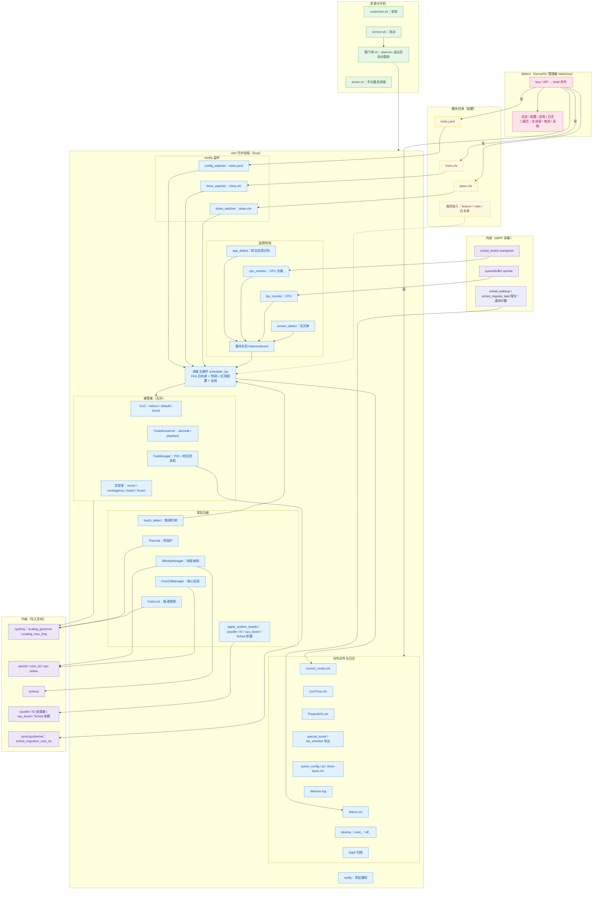

[Read this document in English](README.en.md)

> English support is currently suspended

# ChiRi 调度

**古法（？） CPU 调度：eBPF + Rust + FAS 帧感知调度 + CLG 负载调速器**

---

## 项目介绍

**ChiRi**是一个以日用场景为主的Android CPU调度，以流畅度为主，其次是轻度游戏
低功耗并不是主要目标，但并不代表极差的续航水平
中高负载日用场景尚可，游戏差点意思（
请记住，这不是一个以游戏性能为主的调度。

## 基石

- 模块 fork 自 [yumi](https://github.com/imacte/yumi)，部分核心代码来自上游（上游调度兜底已移除，非目标 SoC 不接管 CPU）。
- 线程调整功能有部分参考了 [AppOptR](https://gitee.com/sutoliu/AppOptR) 。

### 主要特性

- **CLG** - 基于 eBPF 实时负载数据的自适应调频，替代传统内核调速器。
- **WebUI** - KernelSU 管理器内置界面直接管理调度配置，无需安装额外 App
- **场景特调** - ？！特调？！白名单应用（如明日方舟、视频播放）前台时自动切换专属参数，退出自动还原
- **热更新** - 无需重启设备即可更新调度，详见[如何不重启设备更新调度](/mdocs/updateWithoutRestart.md)

## 架构

同一时刻只有一个调度器处于接管状态；切换时先还原上一个调度器写入的频率上限、governor 与核心分组，再由新的调度器接管。不在适配列表的 SoC 不启动调度，只运行监控、WebUI 与日志。

## 环境要求

Android 8.0 (API 26) 及以上 ARM64 (AArch64) 并拥有 Root 权限
内核支持 eBPF（需要 `CONFIG_BPF`、`CONFIG_BPF_SYSCALL` 等内核选项）和 schedutil 调速器

## 性能模式

ChiRi 提供以下模式：

| 模式          | 描述                     | 启用场景               |
| :------------ | :----------------------- | :--------------------- |
| **scenemode** | 树懒模式，尽可能降低功耗 | 暂不支持手动启用       |
| **reduce**    | 降低响应，延长续航       | 待机、轻度使用         |
| **default**   | 自适应调频，平衡         | 万金油                 |
| **boost**     | 高响应配置，性能优先     | 中高负载               |
| **特调**      | 白名单应用专属参数组     | 前台命中白名单自动触发 |
| **FAS**       | 帧时间间隔感知           | FAS 白名单内的游戏     |

---

### 调度核心

ChiRi CLG 调度核心，使用白名单适配soc
[已适配soc列表](/mdocs/socList.md)
没有你的soc或功能适配不完全？当前处于早期测试阶段，正在增加soc适配
不支持的 SoC 不接管 CPU（仅监控/WebUI/日志）
不支持部分特调的soc会回退到CLG模式

#### 核心特性

- **高性能 Rust 实现**: 极低的系统资源占用，运行功耗极低。
- **eBPF 内核级监控**: 通过 `sched_switch` tracepoint 精确采集每核心 CPU 利用率和线程运行时间；通过 `queueBuffer` uprobe 捕获渲染帧间隔（只在 FAS 或播放态挂载，平时零开销）。
- **实时配置监听**: meta.yaml 改完即时生效，不用重启；调优参数和白名单都编译在二进制里，改它们要重新编译。
- **内置 FAS 引擎**: PID 控制器驱动的帧感知调度，支持自动容量权重探测、per-app 配置、CPU 利用率辅助调频。
- **CLG 负载调速器**: 基于 eBPF 实时负载的自适应调频，替代内核原生调速器。
- **多语言国际化**: 基于 Fluent 的 i18n 系统，支持中英文日志输出。

## 性能优化建议

### 日常使用

default 模式覆盖大部分场景。
特调白名单里的应用（明日方舟、哔哩哔哩等）前台时自动切换专属模式，不用手动操作。

### 游戏优化

FAS 白名单内的游戏（明日方舟：终末地、王者荣耀等）前台时会自动进入帧感知调度，不用手动切。
白名单外的游戏用 default 模式，性能不足时切换到 boost 模式。
请谨慎使用 vector 模式，此模式下 CPU 频率可能会锁定为最大（实验室功能，需手动启用）。

## 故障排除

### 常见问题

待更新

## 项目统计

## Star History

<a href="https://www.star-history.com/?repos=Aibeto%2FChiRiScene&type=date&legend=top-left">
 <picture>
   <source media="(prefers-color-scheme: dark)" srcset="https://api.star-history.com/chart?repos=Aibeto/ChiRiScene&type=date&theme=dark&legend=top-left&sealed_token=tf3zEomCrJwH8mUjjoPJ4AYEGRMg4j2ikzBb69MYPk8hz7_LJPCxNNlSn_EzPeOCmXuuudIcf4hXzvAheF8cIHNIzUjGPZ0odO4AEGoNdkeQbOA5kRfoHg" />
   <source media="(prefers-color-scheme: light)" srcset="https://api.star-history.com/chart?repos=Aibeto/ChiRiScene&type=date&legend=top-left&sealed_token=tf3zEomCrJwH8mUjjoPJ4AYEGRMg4j2ikzBb69MYPk8hz7_LJPCxNNlSn_EzPeOCmXuuudIcf4hXzvAheF8cIHNIzUjGPZ0odO4AEGoNdkeQbOA5kRfoHg" />
   
 </picture>
</a>

## 联系方式

- **QQ群** - 1091201364
- **GitHub Issues** - [项目问题和建议](https://github.com/Aibeto/ChiRiScene/issues)

## 开放源代码和免费使用许可

### 主要项目

| Project                                  | License                          | Repository                                                            | Platform |
| :--------------------------------------- | :------------------------------- | :-------------------------------------------------------------------- | :------- |
| imacte/yumi                              | GPL v3.0                         | [GitHub](https://github.com/imacte/yumi)                              | ALL      |
| Sutoliu/AppOptR                          | GPL v3.0                         | [Gitee](https://gitee.com/sutoliu/AppOptR)                            | ALL      |
| torvalds/linux                           | GPL v2.0 WITH Linux-syscall-note | [GitHub](https://github.com/torvalds/linux)                           | SM8550   |
| OnePlusOSS/android_kernel_oneplus_sm8550 | GPL v2.0 WITH Linux-syscall-note | [Github](https://github.com/OnePlusOSS/android_kernel_oneplus_sm8550) | SM8550   |
| AYNTechnologies/linux                    | GPL v2.0 WITH Linux-syscall-note | [Github](https://github.com/AYNTechnologies/linux)                    | SM8550   |
| OnePlusOSS/android_kernel_oneplus_sm8650 | GPL v2.0 WITH Linux-syscall-note | [Github](https://github.com/OnePlusOSS/android_kernel_oneplus_sm8650) | SM8650   |

### 补丁

| Title                                                         | Contributors                    | Patch                                                                                                                                               |
| :------------------------------------------------------------ | :------------------------------ | :-------------------------------------------------------------------------------------------------------------------------------------------------- |
| [PATCH 07/10] arm64: dts: qcom: sm8550: Update EAS properties | Xilin Wu <wuxilin123@gmail.com> | [Patchew](https://patchew.org/linux/20240424-ayn-odin2-initial-v1-0-e0aa05c991fd@gmail.com/20240424-ayn-odin2-initial-v1-7-e0aa05c991fd@gmail.com/) |

### 技术参考项目

| Project            | License  | Repository                                                   |
| :----------------- | :------- | :----------------------------------------------------------- |
| LittleYouran_CTS_3 | GPL v3.0 | [GitHub](https://github.com/LittleYouran/LittleYouran_CTS_3) |
| dieshot            |          | kurnal-insights.com                                          |

### 字体

| Font                     | License     | Repository                                                      | 使用位置 / 注册名    |
| :----------------------- | :---------- | :-------------------------------------------------------------- | :------------------- |
| Poppins                  | SIL OFL 1.1 | [GitHub](https://github.com/google/fonts/tree/main/ofl/poppins) | WebUI 拉丁字母与数字 |
| Noto Sans SC（思源黑体） | SIL OFL 1.1 | [GitHub](https://github.com/notofonts/noto-cjk)                 | WebUI 中文           |
| JetBrains Mono           | SIL OFL 1.1 | [GitHub](https://github.com/JetBrains/JetBrainsMono)            | 全部等宽文本         |

---

ChiRi - 千漓

